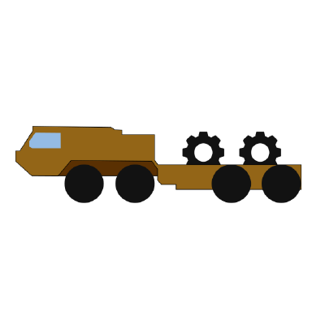

# HEMTT

<div align="center">
  
</div>

> **The modern build system for Arma 3 mods**

[](https://github.com/BrettMayson/HEMTT/releases)
[](https://github.com/BrettMayson/HEMTT/releases)
[](https://app.codecov.io/gh/brettmayson/hemtt)
[](https://acemod.org/discord)

HEMTT is a powerful, opinionated build system designed as a modern replacement for tools like Addon Builder and pboProject. It streamlines Arma 3 mod development by providing fast, reliable builds with built-in linting, scripting capabilities, and seamless CI/CD integration.

---

## ✨ Key Features

- **Fast, Parallel Builds** - Build large mods efficiently with multi-threaded processing
- **Comprehensive Linting** - Catch errors early with built-in checks for SQF, configs, and stringtables
- **Powerful Scripting** - Extend HEMTT with Rhai scripts for custom build hooks and workflows
- **Smart Utilities** - Built-in tools for PAA conversion, audio processing, config inspection, and more
- **VSCode Integration** - First-class IDE support with the official [HEMTT VSCode extension](https://marketplace.visualstudio.com/items?itemName=BrettMayson.hemtt) (alpha)
- **GitHub Integration** - Native support for GitHub Actions and easy CI/CD workflows
- **PAA Viewer** - Browser extension to preview `.paa` files directly on GitHub
- **Best Practices First** - Opinionated design that encourages modern modding workflows

---

## 🚀 Quick Start

### Installation

HEMTT is supported on Windows, Linux, and macOS. Follow the instructions on the [installation page](https://hemtt.dev/installation) to get started.

### Create a New Mod

Add HEMTT to an existing mod or create a new one with:

```bash
hemtt new my-awesome-mod
cd my-awesome-mod
```

### Build Your Mod

```bash
# Check for errors without building
hemtt check

# Development build
hemtt dev

# Release build
hemtt release
```

### Launch with Arma 3

```bash
hemtt launch
```

HEMTT has a [powerful launch system](https://hemtt.dev/commands/launch) that can start Arma 3 with your mod loaded, along with any additional mods or parameters you specify in your configuration. Easily test compatibility with other mods and CDLCs.

---

## 📖 Complete Documentation

Everything you need is available at **[hemtt.dev](https://hemtt.dev)**

### Core Topics

- [Installation & Setup](https://hemtt.dev/installation)
- [Project Configuration](https://hemtt.dev/configuration)
- [All Commands](https://hemtt.dev/commands)
- [Hook Scripting](https://hemtt.dev/rhai/hooks)
- [Linting Rules](https://hemtt.dev/lints)

### Utilities

- Audio processing (inspect, convert, compress)
- PAA/P3D conversion and inspection
- Config derapification
- PBO extraction and unpacking
- SQF formatting

---

## 🔧 Example: GitHub Actions Workflow

Automatically build and release your mod on every push:

```yaml
name: Build

on: [push]

jobs:
    build:
        runs-on: ubuntu-latest
        steps:
            - uses: actions/checkout@v2
            - name: Setup HEMTT
              uses: arma-actions/hemtt@v1
            - name: Run HEMTT build
              run: hemtt release
            - name: Upload Release
              uses: actions/upload-artifact@v4
              with:
                  name: my-mod-latest
                  path: release/my-mod-latest.zip
```

---

## 🌐 Browser Extensions

View `.paa` files directly on GitHub!

| [Firefox](https://addons.mozilla.org/en-US/firefox/addon/hemtt/) | [Chrome](https://chromewebstore.google.com/detail/glhbbnnlagbnmkclalflihdnfhbjmmip) |
| -- | -- |
| [](https://addons.mozilla.org/en-US/firefox/addon/hemtt/) | [](https://chromewebstore.google.com/detail/glhbbnnlagbnmkclalflihdnfhbjmmip) |

---

## 💬 Community

Have questions? Join #hemtt in the [ACE3 Discord](https://acemod.org/discord) to connect with other modders and get help.

---

## 📜 Attribution

File icons contain elements made in whole or in part by [Freepik - Flaticon](https://www.flaticon.com/authors/freepik)
